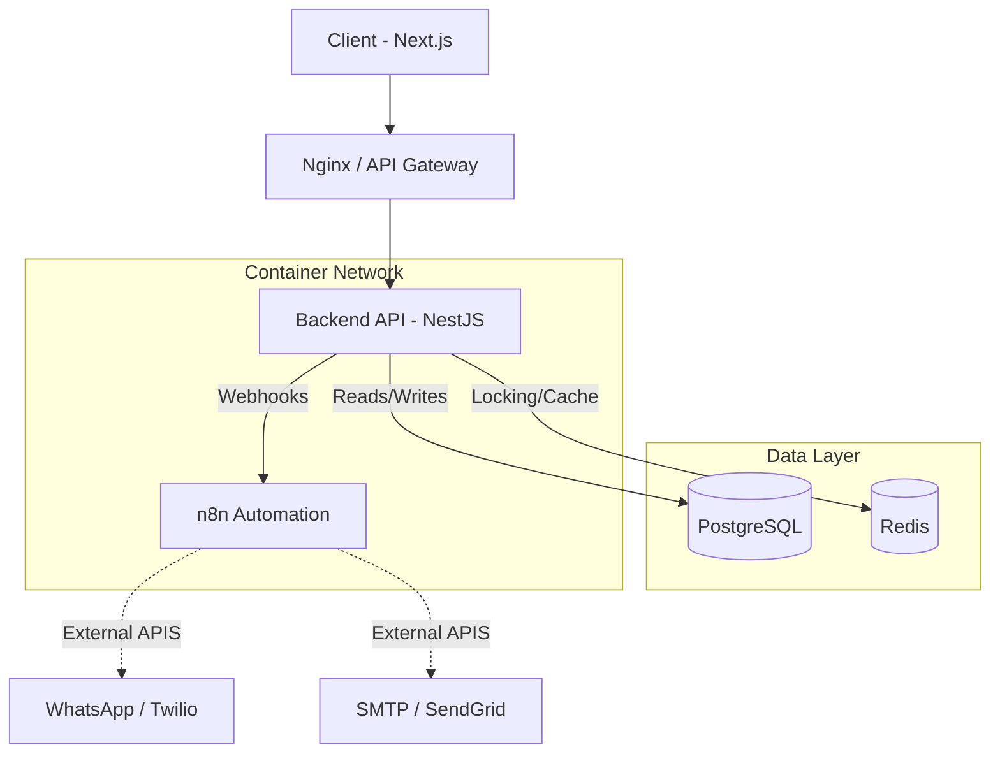
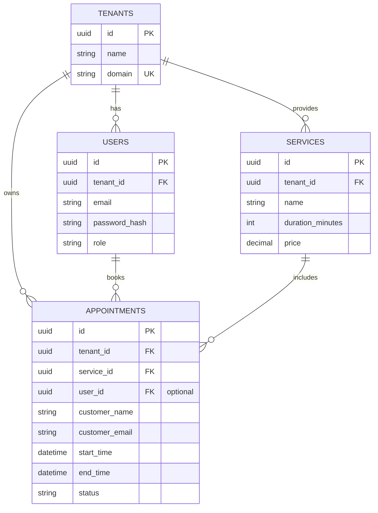

# SyncHub SaaS - Multi-Tenant Appointment & Automation Platform

SyncHub is a comprehensive Multi-Tenant SaaS platform designed for businesses to manage their appointments, integrated dynamically with n8n for workflow automation.

## Project Architecture



## Entity-Relationship (ER) Diagram



## API Guide

### `POST /appointments`
Creates a new appointment for a specific tenant and service. Emits a webhook to n8n upon successful creation.

**Request Header:**
```json
{
  "x-tenant-id": "11111111-1111-1111-1111-111111111111",
  "Content-Type": "application/json"
}
```

**Request Body:**
```json
{
  "serviceId": "33333333-3333-3333-3333-333333333333",
  "customerName": "Alice Smith",
  "customerEmail": "alice@gmail.com",
  "customerPhone": "+905551234567",
  "startTime": "2024-05-15T10:00:00Z"
}
```

**Successful Response (201 Created):**
```json
{
  "success": true,
  "data": {
    "id": "new-uuid",
    "status": "scheduled",
    "endTime": "2024-05-15T10:30:00Z"
  }
}
```

## Automation System (n8n Webhooks)

SyncHub relies on an integrated **n8n docker container** to handle asynchronous tasks and business logic without bloating the main API.

### Use Case: WhatsApp Appointment Reminder
1. An appointment is created via `POST /appointments`.
2. NestJS API securely calls the n8n Webhook Endpoint (`http://localhost:5678/webhook/appointment-created`) with the appointment payload (encrypted/signed with HMAC).
3. The **n8n Workflow** is triggered:
   - Evaluates if a phone number was provided.
   - Waits until 24 hours before the `startTime` (Wait Node).
   - Prepares a message string: *"Hi Alice, a reminder for your Haircut tomorrow at 10:00 AM."*
   - Sends the message via Twilio or WhatsApp Business Cloud API node.
